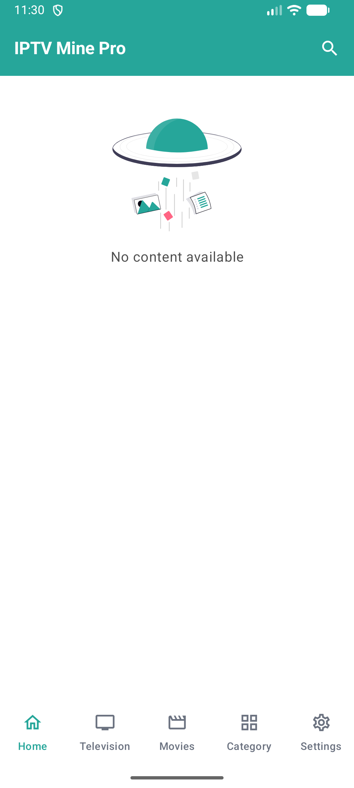
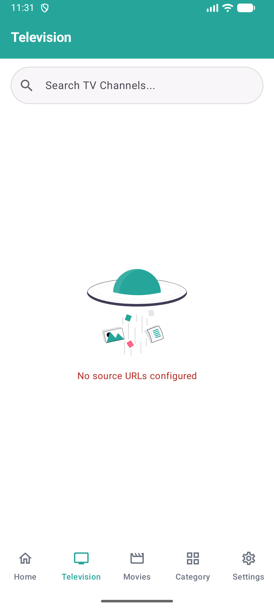
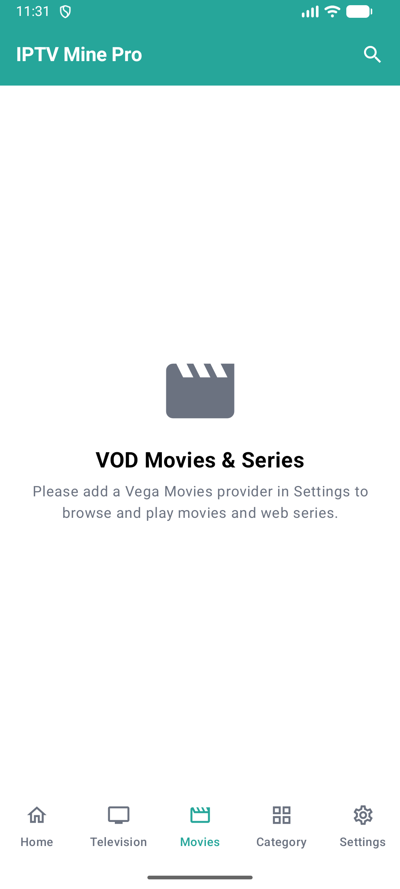
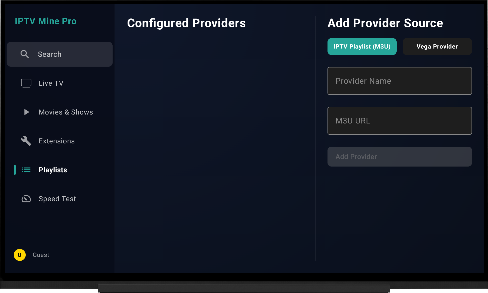
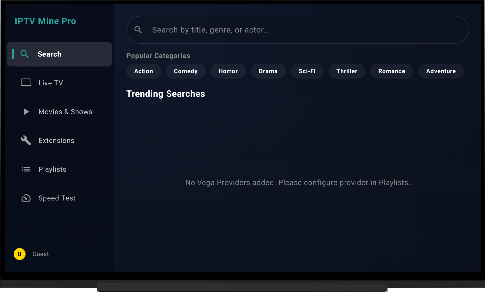
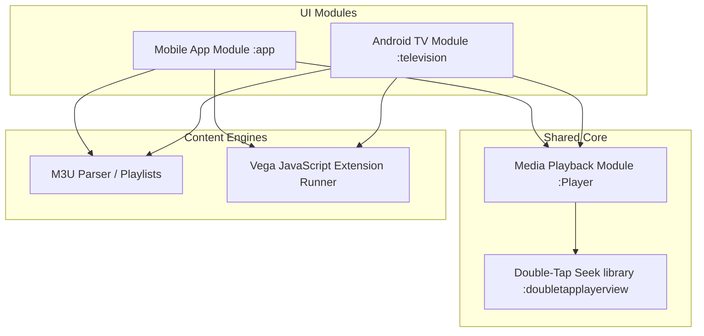

# 📺 IPTVMine Pro

[](https://kotlinlang.org/)
[](https://developer.android.com/jetpack/compose)
[](https://developer.android.com/guide/topics/media/media3)
[](LICENSE)

> [!WARNING]
> **This project is currently under construction.** Features are being actively developed, and some parts of the codebase might be unstable.

> [!IMPORTANT]
> **Disclaimer**: IPTVMine Pro App does not host, store, or provide any media content. It is not affiliated with or connected to any external providers or extensions. All content accessed through the app is managed and sourced directly by the user via third-party tools or integrations. Vega App has no control over it.

IPTVMine Pro is a premium, versatile, and high-performance Android IPTV application built with modern Android development paradigms. It enables users to stream Live TV, Movies, and TV Shows by integrating standard M3U playlists and advanced Vega-compatible JavaScript/TypeScript provider extensions.

---

## 🎨 Screenshot Galleries

### Mobile App UI
<p align="center">
  
  
  
</p>

### Android TV UI
<p align="center">
  
  
</p>

---

## ⚙️ Architecture & Module Breakdown

The project is structured as a multi-module Gradle project to enforce clean separation of concerns, improve build speeds, and share playback/scraping modules between the Mobile and Android TV apps.



### Module Descriptions
- **[:app](file:///c:/Users/ADMIN/AndroidStudioProjects/IPTVMine-Pro/app/)**: The main phone/tablet client built using Jetpack Compose, containing provider configurations, watch history, downloads, search, and device pairing setups.
- **[:television](file:///c:/Users/ADMIN/AndroidStudioProjects/IPTVMine-Pro/television/)**: A tailored Android TV Leanback/TV-Compose app optimized for D-pad navigation, featuring weather forecast screens, custom pairing receivers, and dynamic layouts.
- **[:Player](file:///c:/Users/ADMIN/AndroidStudioProjects/IPTVMine-Pro/Player/)**: A shared media playback library wrapper for AndroidX Media3 (ExoPlayer) with PiP (Picture-in-Picture) lifecycle support.
- **[:doubletapplayerview](file:///c:/Users/ADMIN/AndroidStudioProjects/IPTVMine-Pro/doubletapplayerview/)**: Custom Compose component providing YouTube-like double-tap-to-seek overlays on top of the media controller.

---

## 🚀 Key Features

### 📱 Mobile Experience
- **Live TV Streaming**: Load massive M3U playlists with rapid group filtering, quick search, and category list UI.
- **VOD Catalogs**: Categorized movies and TV shows gathered from active provider channels.
- **Local Downloads**: Manage offline VOD downloads with progress tracking and storage control.
- **Watch History & Bookmarks**: Keep track of recently played channels, movies, and current playback resume positions.
- **Mobile-TV Pairing**: Scan and pair with your Android TV module to synchronize and cast provider content.

### 📺 Android TV Experience (`television`)
- **Leanback Engine & Compose**: Fluid 10ft user interface tailored for standard remote control D-pads.
- **Universal Search**: On-screen keyboard for looking up channels and series across all scrapers.
- **Integrated Speed Test**: Measure real-time network download speeds and latency straight from your TV.
- **Weather Dashboard**: Full Compose-based weather forecast widget showing current weather parameters and upcoming days' outlook.
- **Smart Episode Filtering**: Clean, filtered lists of episodes that automatically hide warning messages and dead scraper links.

### 🌐 Advanced Extension Engine (Vega Scrapers)
- Uses a headless JS/TS WebView bridge to execute custom external scrapers securely.
- **Automatic Playback**: Resolves streams dynamically and starts the highest-quality source first.
- **Resilient Execution**: Implements a 3-attempt JS evaluation retry loop with automatic WebView re-creation on scrapes that timeout.
- For a developer guide on writing JS extensions, see [VEGA_DOCS.md](VEGA_DOCS.md).

---

## 🛠 Tech Stack

- **Language**: [Kotlin](https://kotlinlang.org/)
- **UI Framework**: [Jetpack Compose](https://developer.android.com/jetpack/compose) & [Compose for TV](https://developer.android.com/develop/ui/compose/tv)
- **Media Engine**: [AndroidX Media3 (ExoPlayer)](https://developer.android.com/guide/topics/media/media3)
- **Networking**: [OkHttp](https://square.github.io/okhttp/) & [Gson](https://github.com/google/gson)
- **Async Execution**: [Kotlin Coroutines](https://kotlinlang.org/docs/coroutines-overview.html) & Flow
- **Image Loading**: [Coil](https://coil-kt.github.io/coil/)
- **Animations**: [Lottie for Compose](https://github.com/airbnb/lottie-android)

---

## 🏁 Getting Started

### Prerequisites
- Android Studio Ladybug/Meerkat or newer.
- JDK 17 configured in Android Studio Gradle settings.
- Android SDK 24+ (Minimum SDK) / SDK 36 (Target SDK).

### Installation & Run

1. Clone this repository:
   ```bash
   git clone https://github.com/samyak2403/IPTVMine-Pro.git
   ```
2. Open Android Studio and import the directory.
3. Gradle Sync the project.
4. Select your run configuration target:
   - **`app`**: To run the mobile/tablet client.
   - **`television`**: To run the Android TV client (use an Android TV Emulator or physical TV box with Developer Options enabled).

---

## 🐞 Bugs, Testing & Contributions

We track active defects and code health details in [BUGS.md](BUGS.md). Feel free to refer to it for API compatibility considerations and known lifecycle issues.

- To submit bug reports, navigate to **Settings > Bug Report** in the mobile app, or open a GitHub issue.
- Maintainers can review ongoing issues in [BUGS.md](BUGS.md)'s defect registry before submitting Pull Requests.

---
*Built with ❤️ for the Android & IPTV Developer Community.*
